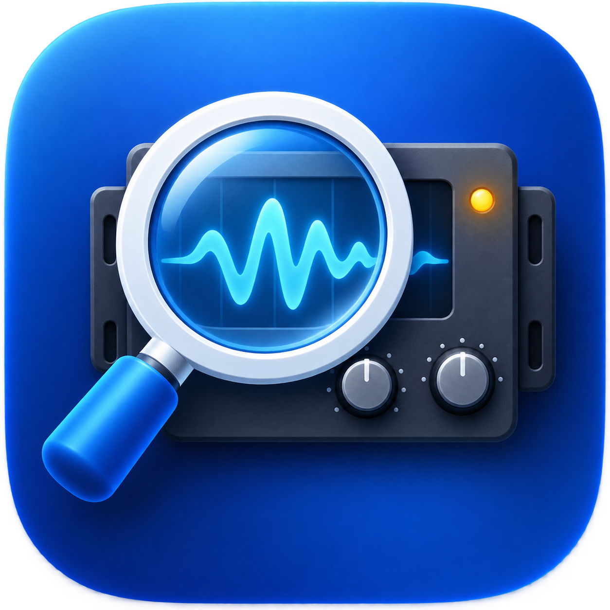

# Plug-in Safe Cleaner

<p align="center">
  
</p>

Logic ProやUAD LUNAに残って見えるAudio Unit / VST / VST3 / AAX / LUNAプラグインを確認し、完全削除せず隔離するmacOS用SwiftUIアプリです。

[最新版をダウンロード](https://github.com/fattime73-coder/PluginSafeCleaner/releases/latest) · [プライバシー](PRIVACY.md)

> [!IMPORTANT]
> 「壊れている可能性」はファイル構造からの安全側の判定です。不要なプラグインであることを確認してから隔離してください。アプリが自動で完全削除することはありません。

## 動作環境

- macOS 13 Ventura以降
- 公開済みバイナリはApple Silicon向け
- ソースからのビルドにはXcode Command Line Toolsが必要

## インストール

1. [Releases](https://github.com/fattime73-coder/PluginSafeCleaner/releases/latest)から`PluginSafeCleaner.zip`をダウンロードします。
2. ZIPを展開し、`PluginSafeCleaner.app`を「アプリケーション」フォルダへ移動します。
3. 初回起動時にmacOSが確認を表示した場合は、Finderでアプリを右クリックして「開く」を選びます。

配布版はローカル用のアドホック署名です。Appleの公証は取得していません。

## 安全設計

- スキャンだけではファイルを変更しません。
- 「存在する＝残骸」とは判断せず、通常・破損候補・無効化候補・重複候補・キャッシュを分けます。
- 検索画面のAAX、VST/VST3、AU、UA/LUNAボタンで形式をすぐ絞り込めます。
- 「壊れている可能性」だけの表示と、表示条件に一致する候補の一括選択ができます。
- 隔離前にLogic Pro / LUNA / MainStage / Pro Toolsの起動状態を確認します。
- 隔離先は `~/Documents/PlugIn Safe Cleaner/Quarantine/日時/` です。
- 元の場所と隔離先を `manifest.json` に記録し、アプリ内の「隔離履歴」から復元できます。
- `/Library` 内の項目を複数選択しても、macOSの管理者認証は一括処理につき1回だけです。
- `/System/Library`、LUNA Sessions、プリセット、ライセンス関連は対象外です。
- 同名ファイルが元の場所にある場合、復元時に上書きしません。

## 確認する場所

- `~/Library/Audio/Plug-Ins/Components` と `/Library/Audio/Plug-Ins/Components`
- `~/Library/Audio/Plug-Ins/VST` と `/Library/Audio/Plug-Ins/VST`
- `~/Library/Audio/Plug-Ins/VST3` と `/Library/Audio/Plug-Ins/VST3`
- ユーザー/システムのAvid AAXプラグインフォルダ
- Universal AudioのLUNAコンポーネントと確認用の状態ファイル
- `~/Library/Caches/AudioUnitCache`
- LUNAのユーザーワークスペースキャッシュ

## 推奨手順

1. Logic ProとLUNAを終了します。
2. アプリで「もう一度確認」を押します。
3. 判定理由とパスを確認し、本当に不要な項目だけ選びます。
4. 「隔離へ進む」を押します。
5. Logic Proではプラグインマネージャの「Audio Unitsを完全にリセット」、LUNAではManage Plug-Insの「Rescan All」を使います。
6. 問題がなければ隔離ファイルをしばらく保管します。問題が出た場合は「隔離履歴」から戻します。

## ビルド

macOS 13以降とXcode Command Line Toolsが必要です。

```sh
./make_app.sh
```

生成物は `dist/` に作られます。外部ライブラリやネットワーク接続は使用しません。

テストは次のコマンドで実行できます。

```sh
./test.sh
```

テストでは、保護対象パスの判定、読み取り専用スキャン、一括隔離用スクリプトの構文、スペースやアポストロフィを含むファイル名の移動を確認します。実際のプラグインは移動しません。

## 注意

- DAWとプラグインメーカーが提供する正式なアンインストーラがある場合は、そちらを先に使用してください。
- AAXはLogic ProやLUNAでは使用されませんが、残骸確認のため一般的なAvid配置もスキャン対象にしています。
- キャッシュ隔離は通常の再スキャンで解決しない場合の最終手段です。
- 現時点ではライセンスファイルを付与していません。
